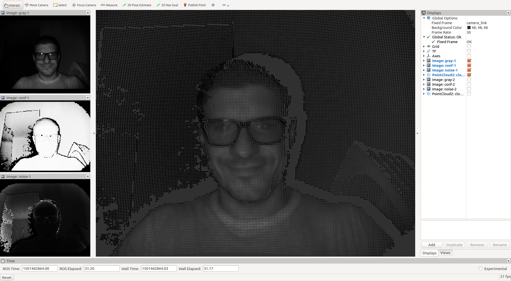
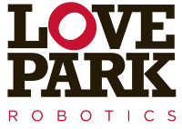

royale-ros
==========
royale-ros is a wrapper around the [pmd](http://www.pmdtec.com/) Royale SDK
enabling the usage of [pmd-based ToF cameras](http://pmdtec.com/picofamily/)
from within [ROS](http://www.ros.org/) software systems.

Software Compatibility Matrix
-----------------------------

_This software is still under active development working toward its first
supported release version. Use the HEAD at your own risk. Everything is subject
to change. You have been warned._

<table>
  <tr>
    <th>royale-ros version</th>
    <th>Royale SDK version</th>
    <th>Linux/ROS distribution pair(s)</th>
    <th>Supported Hardware</th>
  </tr>
  <tr>
    <td>0.1.0</td>
    <td>3.5</td>
    <td>Ubuntu 16.04/Kinetic</td>
    <td>Pico Flexx</td>
  </tr>
</table>

**NOTE:** Theoretically, any camera supported by Royale will be compatible with
  this library. However, the above listed hardware is what we have availale to
  us for testing. We welcome your feedback related to other Royale-based
  cameras and their compatibility with this ROS interface.

**NOTE 2:** This library is (currently) limited to Royale's Level 1 access
  features.

Building and Installing the Software
------------------------------------
As stated above, `royale-ros` is a wrapper around pmd's Royale SDK. To that
end, the Royale SDK needs to be installed on your system. Due to licensing
concerns, you will need to acquire the Royale software directly from
pmd. [Here](http://pmdtec.com/picofamily/software/) is a link to their software
download page (password protected -- contact pmd directly for a customer
password). Once you have acquired the binary SDK (typically in a file called
`libroyale.zip`), you can either install it according to the instructions
provided with it, or follow [our instructions](doc/royale_install.md) which
allow you to integrate it with your package manager (assuming you are on a
Debian-based system like Ubuntu). Once you have installed Royale, continue on
with the instructions below to build and install `royale-ros`.

Building and installing `royale-ros` is done via
[catkin](http://wiki.ros.org/catkin). The following step-by-step instructions
should get you up-and-running quickly -- we realize there are various ways of
doing this, one viable way now follows.

First, we need to decide where we want our software to ultimately be
installed. For purposes of this document, we will assume that we will install
our ROS packages at `~/ros`. For convenience, we add the following to our
`~/.bash_profile`:

```
if [ -f /opt/ros/kinetic/setup.bash ]; then
  source /opt/ros/kinetic/setup.bash
fi

cd ${HOME}

export LPR_ROS=${HOME}/ros

if [ -d ${LPR_ROS} ]; then
    for i in $(ls ${LPR_ROS}); do
        if [ -d ${LPR_ROS}/${i} ]; then
            if [ -f ${LPR_ROS}/${i}/setup.bash ]; then
                source ${LPR_ROS}/${i}/setup.bash --extend
            fi
        fi
    done
fi
```

Next, we need to get the code from github. We assume we keep all of our git
repositories in `~/dev`.

```
$ cd ~/dev
$ git clone https://github.com/lovepark/royale-ros.git
```

We now have the code in `~/dev/royale-ros`. Next, we want to create a _catkin
workspace_ that we can use to build and install that code from. It is the
catkin philosophy that we do not do this directly in the source directory.

```
$ cd ~/catkin
$ mkdir royale
$ cd royale
$ mkdir src
$ cd src
$ catkin_init_workspace
$ ln -s ~/dev/royale-ros royale
```

So, you should have a catkin workspace set up to build the royale-ros code that
looks basically like:

```
[ ~/catkin/royale/src ]
tpanzarella@tuna: $ pwd
/home/tpanzarella/catkin/royale/src

[ ~/catkin/royale/src ]
tpanzarella@tuna: $ ls -l
total 0
lrwxrwxrwx 1 tpanzarella tpanzarella 50 Jul 21 11:36 CMakeLists.txt -> /opt/ros/kinetic/share/catkin/cmake/toplevel.cmake
lrwxrwxrwx 1 tpanzarella tpanzarella 33 Jul 21 11:37 royale -> /home/tpanzarella/dev/royale-ros/
```

Now we are ready to build the code.

```
$ cd ~/catkin/royale
$ catkin_make
$ catkin_make -DCMAKE_INSTALL_PREFIX=${LPR_ROS}/royale install
```

The ROS package should now be installed in `~/ros/royale`. To test everything
out (assuming you have your camera plugged in) you should open a fresh bash
shell, and start up a ROS core:

```
    $ roscore
```

Open another shell and start the camera node:

```
    $ roslaunch royale_ros camera.launch
```

Open another shell and start the rviz node to visualize the data coming from
the camera:

```
    $ roslaunch royale_ros rviz.launch
```

At this point, you should see an rviz window that looks something like:



Congratulations! You can now utilize royale-ros.

_(more documentation is forthcoming)_

TODO
----
Please see the [Github Issues](https://github.com/lovepark/royale-ros/issues).

LICENSE
-------
Please see the file called [LICENSE](LICENSE).

ATTRIBUTION
-----------
The initial development of `royale-ros` has been sponsored by
[Locus Robotics](http://www.locusrobotics.com/). The authors thank them for
their contribution to the open-source robotics community.

AUTHORS
-------
Tom Panzarella <tom@loveparkrobotics.com>

<p align="center">
  <br/>
  
  <br/>
  Copyright &copy; 2017 Love Park Robotics, LLC
</p>
