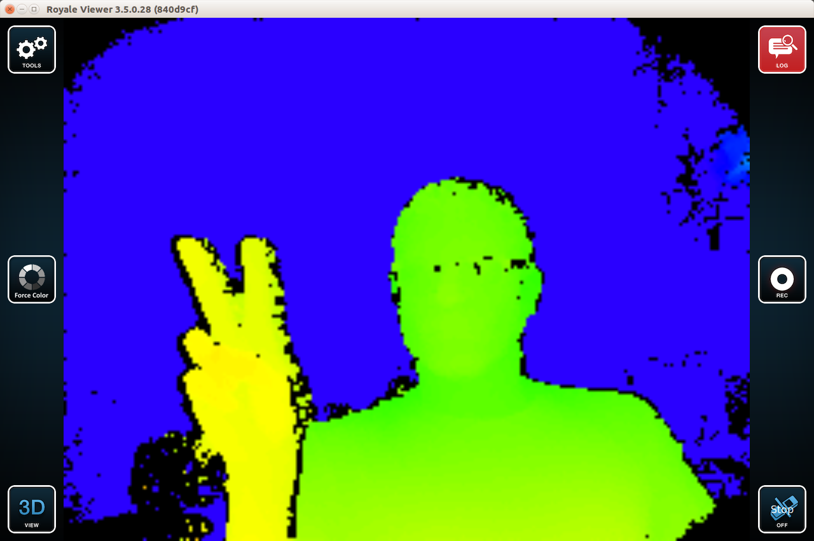

Installing the Royale SDK
=========================
The Royale SDK is distributed as a standalone, binary-only package directly
from pmd. It is typically packaged in a file called `libroyale.zip`. This
document assumes you have that zip file available to you. The pmd-distributed
Royale SDK comes with installation instructions and you are free to follow
those. However, in this document, we present an alternate
approach. Specifically, we provivde a method to repackage the SDK as a debian
package so that it can be cleanly integrated with the Debian/Ubuntu package
manager.

**NOTE:** We assume you are on a Linux machine with Python 2.7, `dpkg`, and
  `unzip`.

Repackaging Royale as a deb is handled via our
[debianize-royale.py](../utils/debianize-royale.py) script. Assuming you
are at the top-level of this source distribution, you can interface with
`debianize-royale.py` as follows:

```
[ ~/dev/royale-ros ]
tpanzarella@tuna: $ cd utils/

[ ~/dev/royale-ros/utils ]
tpanzarella@tuna: $ ./debianize-royale.py --help
usage: debianize-royale.py [-h] --infile INFILE [--prefix PREFIX]
                           [--arch {x86_32,x86_64,arm_32}] [--full]

Create a deb file for the Royale SDK from libroyale.zip

optional arguments:
  -h, --help            show this help message and exit
  --infile INFILE       Input libroyale.zip file (default: None)
  --prefix PREFIX       Root directory for the deployed Royale SDK.
                        Specifically, the SDK will be installed in
                        `<prefix>/libroyale-<version>-LINUX-<arch>' and a
                        symlink will be be created such that: `<prefix>/royale
                        -> <prefix>/libroyale-<version>-LINUX-<arch>' Typical
                        choices for `--prefix' are `/opt' or `/usr/local'.
                        (default: /opt)
  --arch {x86_32,x86_64,arm_32}
                        Architecture for target deb file (default: x86_64)
  --full                Debianize the full SDK (default: False)
```

As noted in the help message above, `debianize-royale.py` is parameterized via
an `--infile` (the full path to your `libroyale.zip` file acquired from pmd),
`--prefix` (the root-level prefix for where you want Royale installed), and the
`--arch` (the architecture-specific SDK you wish to re-package as a deb). There
is also the `--full` flag. If included on the command-line it will install the
*full* Royale SDK, including the GUI, example programs, documentation, etc. For
ROS users, **this is not recommended**. The Royale SDK installs its own copies
of various Qt libraries that, depending upon where they are in your runtime
linker's path, could render some ROS tools (e.g., `rqt_graph`) unusable.

For the example that follows, we will install Royale into `/opt` (the default)
and build the 64-bit x86 Linux package (also the default).

```
[ ~/dev/royale-ros/utils ]
tpanzarella@tuna: $ ./debianize-royale.py --infile=~/dev/royale/libroyale.zip
Working directory is: /tmp/debianize-royale-vJO1n5
unzip -q ~/dev/royale/libroyale.zip -d /tmp/debianize-royale-vJO1n5/unzipped
All available SDK's include: ['libroyale-3.5.0.28-LINUX-x86-64Bit.zip', 'libroyale-3.5.0.28-LINUX-x86-32Bit.zip', 'libroyale-3.5.0.28-APPLE-x86-64Bit.zip', 'libroyale-3.5.0.28-LINUX-arm-32Bit.zip', 'libroyale-3.5.0.28-ANDROID-arm-64Bit.zip', 'libroyale-3.5.0.28-ANDROID-arm-32Bit.zip']
The valid LINUX SDK's include: ['libroyale-3.5.0.28-LINUX-x86-64Bit.zip', 'libroyale-3.5.0.28-LINUX-x86-32Bit.zip', 'libroyale-3.5.0.28-LINUX-arm-32Bit.zip']
Found target SDK: libroyale-3.5.0.28-LINUX-x86-64Bit.zip
Parsed out Royale version as: {'major': '3', 'rev': '28', 'minor': '5', 'patch': '0'}
Working deb dir is: /tmp/debianize-royale-vJO1n5/deb
unzip -q /tmp/debianize-royale-vJO1n5/unzipped/libroyale-3.5.0.28-LINUX-x86-64Bit.zip -d /tmp/debianize-royale-vJO1n5/deb/opt
SDK extracted to: /tmp/debianize-royale-vJO1n5/deb/opt/libroyale-3.5.0.28-LINUX-x86-64Bit
Creating control file...
Creating postinst shell script...
Creating prerm shell script...
Creating udev rules file...
dpkg -b /tmp/debianize-royale-vJO1n5/deb royale-sdk_3.5.0-28_amd64.deb
dpkg-deb: building package 'royale-sdk' in 'royale-sdk_3.5.0-28_amd64.deb'.
Removing tmp directory: /tmp/debianize-royale-vJO1n5

```

The output of `debianize-royale.py` is a bit verbose, however, that is for
debugging should any issues arise. Once the script is complete, you should have
the repackaged deb file in your current working directory:

```
[ ~/dev/royale-ros/utils ]
tpanzarella@tuna: $ ls -l *.deb
-rw-r--r-- 1 tpanzarella tpanzarella 18160002 Jul 21 09:24 royale-sdk_3.5.0-28_amd64.deb
```

You can now install it as you would any other debian package:

```
[ ~/dev/royale-ros/utils ]
tpanzarella@tuna: $ sudo dpkg -i royale-sdk_3.5.0-28_amd64.deb
[sudo] password for tpanzarella:
Selecting previously unselected package royale-sdk.
(Reading database ... 488236 files and directories currently installed.)
Preparing to unpack royale-sdk_3.5.0-28_amd64.deb ...
Unpacking royale-sdk (3.5.0-28) ...
Setting up royale-sdk (3.5.0-28) ...
Creating new symlink: /opt/royale -> /opt/libroyale-3.5.0.28-LINUX-x86-64Bit
```

You'll note on the last line of output, a convenience symlink has been created
for you. If you did not install the "full" SDK, you are done. The necessary
libraries, headers, and udev rules are in place and you can begin to
install/use `royale-ros`.

If you did install the "full" SDK, to validate the installation, you should now
plug in your camera. For exemplary purposes, we will use a Pico Flexx. Once
your camera is plugged in, you can follow the steps below:

```
[ ~/dev/royale-ros/utils ]
tpanzarella@tuna: $ cd /opt/royale/bin/

[ /opt/royale/bin ]
tpanzarella@tuna: $ ./royaleviewer.sh
```

You should see output similar to the following:

<p align="center">
  
</p>

Since we have integrated Royale with our package manager, uninstalling it can
be done as follows:

```
[ ~/dev/royale-ros/utils ]
tpanzarella@tuna: $ sudo dpkg --purge royale-sdk
(Reading database ... 489225 files and directories currently installed.)
Removing royale-sdk (3.5.0-28) ...
Removing: /opt/royale
```
